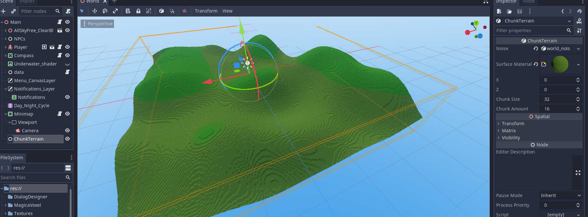

# Chunk_Terrain_Godot

- Simple:
Sometimes simplicity is all you need. This module lets you generate Blocky SDF terrains with water, grass and trees instancing. 

# Instructions:

- Clone the module, rename it to chunk_terrain and move to godot/modules folder.
- Compile godot normally.

## DOCUMENTATION

- Changelog:

Basic generator is working

- TODO:

Auto-generate chunks and handle them
