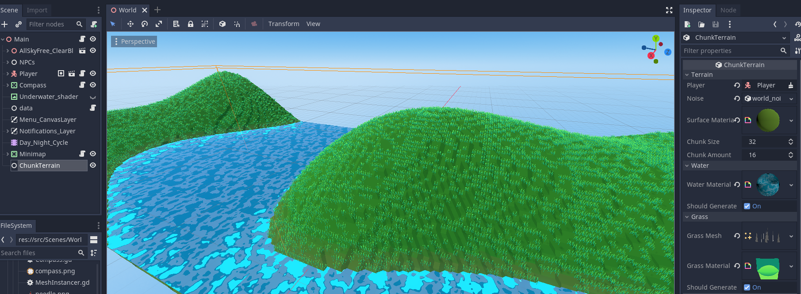

# Chunk_Terrain_Godot

- Simple:
Sometimes simplicity is all you need. This module lets you generate Blocky SDF terrains with water, grass and trees instancing. 

## DISCORD

## ABOUT THE MODULE

- This is being currently developed alongside Trials Of Morana, a 3D, procedural, story-driven game. This modules brings speed and ease-of-use to noise terrains.

## DOCUMENTATION

# Instructions:

- Clone the module, rename it to chunk_terrain and move to godot/modules folder.
- Compile godot normally.
- Set material and noise.
- Assign a player.
- Close/Open scene to see changes in editor, or just run.

# Changelog:

- 07/22/2021 - Auto-generates terrain and threads,clean-up threads
- 07/23/2021 - Player is automatically found and used once assigned. No scripts are needed anymore
- 07/25/2021 - Generate water
- 07/26/2021 - Generate grass

# TODO:

- Generate trees
- Let clamping be optional
- Add noise to grass
- Let user define min and max grass height
- Add noise to trees
- Let user define min and max tree height

